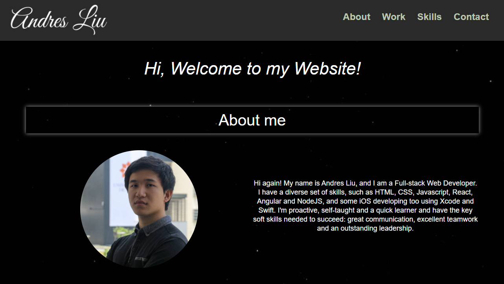

# Hi, my name is Andres Liu and this is my portfolio!

## About me

* I am a Full-stack Web Developer. I'm proactive, self-taught and a quick learner and have the key soft skills needed to succeed: great communication, excellent teamwork and an outstanding leadership.

## Site Picture

## My Work

* [Rank-A-Drank](https://andresliu22.github.io/rank-a-drank/)
* [Weather Dashboard](https://andresliu22.github.io/weather-dashboard/)
* [Day Planner](https://andresliu22.github.io/day-planner/)
* [Code Quiz](https://andresliu22.github.io/code-quiz/)
* [Password Generator](https://andresliu22.github.io/password-generator/)

## Skills

* HTML
* CSS
* Javascript
* JQuery
* Angular
* React
* NodeJS
* Xcode
* Swift
* SQL

## Built With

* [HTML](https://developer.mozilla.org/en-US/docs/Web/HTML)
* [CSS](https://developer.mozilla.org/en-US/docs/Web/CSS)
* [Javascript](https://developer.mozilla.org/en-US/docs/Web/javascript)
* [JQuery](https://jquery.com/)

## Deployed Link

* [See Live Portfolio](https://andresliu22.github.io/updated-portfolio/)

## Author

* **Andres Liu** 

## Contacts

* [Linkedin](https://www.linkedin.com/in/andresliu22)
* [Github](https://github.com/andresliu22)

## Acknowledgments

* Always do some research to get the best possible way to code anything.
* Make the website and code easy to read for viewers and other developers by using brief comments.
* Be use to commit to get an insight of what you have done for each progress you make.